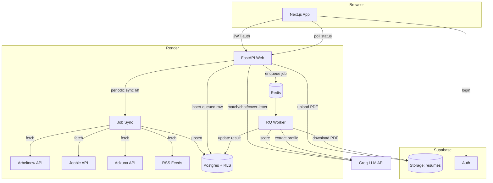

# Resume Matcher

> Score how well a resume matches a job description — with an explanation of
> *why*, a list of *missing skills*, and **live job aggregation** from multiple
> sources. A production-quality, full-stack service built to demonstrate system
> design, async job processing, auth, LLM integration, and real-time data
> pipelines for SWE / Data-ML new-grad roles.

**Stack:** FastAPI · Supabase (Postgres + Auth) · Groq LLM · Redis + RQ ·
Next.js (shadcn/ui) · deployed 100% free (Render + Vercel + Supabase).

---

## Features

- **Resume scoring** — upload a PDF + job description → LLM-powered match report
  (score, matched/missing skills, rationale).
- **Live job aggregation** — fetches jobs from RemoteOK, We Work Remotely, Jooble,
  Adzuna, Arbeitnow, and RSS feeds; deduplicates and normalises into a single
  feed.
- **Job browsing** — filter by remote, location, employment type, experience
  level, salary range, and source. Infinite scroll, markdown descriptions.
- **Job matching** — score-based recommendations against your profile.
- **Profile management** — structured profile (skills, experience, education,
  projects) with agent-assisted chat-based filling.
- **Agent chat** — conversational profile builder using Groq LLM.
- **Application tracking** — manage job applications with status pipeline
  (draft → applied → interviewing → offer → rejected).
- **Cover letter generator** — auto-generate tailored cover letters via LLM.
- **Secure auth** — Supabase Auth with JWT verification (HS256 or JWKS-based
  ES256/RS256).

---

## Architecture



**Request flow**
1. User logs in (Supabase email/password) → gets a JWT.
2. **Resume scoring**: POST resume + JD → API enqueues RQ job → worker scores via
   Groq → result written to Postgres → frontend polls for completion.
3. **Job browsing**: GET `/api/jobs` lists live-aggregated jobs with filters.
   Background sync runs every 6 hours, or on-demand when the DB is empty.
4. **Profile / Chat**: agent-assisted profile editing using Groq.
5. **Applications**: track jobs you've applied to with status updates.

---

## Repository layout

```
resume-matcher/
├─ backend/                        # FastAPI API + RQ worker (deployed on Render)
│  ├─ app/
│  │  ├─ api/                      # routes: analyses, auth, health, internal
│  │  │  ├─ analyses.py            # resume scoring endpoint
│  │  │  ├─ applications.py        # application CRUD
│  │  │  ├─ chat.py                # agent chat endpoint
│  │  │  ├─ health.py              # health check
│  │  │  ├─ internal.py            # internal (reaper) endpoint
│  │  │  ├─ jobs.py                # job listing + match endpoint
│  │  │  └─ profiles.py            # user profile CRUD
│  │  ├─ core/                     # config, supabase clients, redis queue, JWT verify
│  │  ├─ services/                 # pdf_extract, storage, llm, matcher
│  │  │  ├─ chat_agent.py          # conversational profile builder
│  │  │  ├─ cover_letter.py        # cover letter generator
│  │  │  ├─ matcher_v2.py          # job score matcher
│  │  │  └─ profile_extraction.py  # resume → structured profile
│  │  ├─ jobs/                     # job aggregation system
│  │  │  ├─ fetcher.py             # orchestrator: runs all sources
│  │  │  ├─ sync.py                # upserts jobs to Supabase
│  │  │  └─ sources/               # modular per-source scrapers
│  │  │      ├─ base.py            # ABC with normalized_job()
│  │  │      ├─ arbeitnow.py       # Arbeitnow API
│  │  │      ├─ jooble.py          # Jooble API (with salary parser)
│  │  │      ├─ adzuna.py          # Adzuna API
│  │  │      └─ rss_source.py      # RemoteOK, We Work Remotely, LinkedIn RSS
│  │  ├─ models/                   # Pydantic schemas
│  │  ├─ db/schema.sql             # Postgres schema + RLS policies
│  │  ├─ worker.py                 # RQ task (analysis + profile extraction)
│  │  └─ main.py                   # app factory + periodic sync
│  ├─ tests/
│  ├─ Dockerfile / render.yaml
│  └─ .env.example
├─ frontend/                       # Next.js (deployed on Vercel)
│  ├─ app/
│  │  ├─ jobs/                     # job browsing with infinite scroll + filters
│  │  ├─ applications/             # application tracker
│  │  ├─ profile/                  # profile editor + agent chat
│  │  ├─ upload/                   # resume upload
│  │  ├─ history/                  # past analysis results
│  │  └─ login/                    # auth page
│  ├─ components/
│  │  ├─ JobCard.tsx               # job listing card
│  │  ├─ JobFilters.tsx            # collapsible filter sidebar
│  │  ├─ ProfileForm.tsx           # structured profile editor
│  │  ├─ ChatPanel.tsx             # agent chat UI
│  │  ├─ Navbar.tsx                # auth-aware navigation
│  │  ├─ ResultCard.tsx            # analysis result display
│  │  ├─ ScoreRing.tsx             # circular score viz
│  │  ├─ FileDropzone.tsx          # drag-and-drop upload
│  │  └─ ui/                       # shadcn/ui primitives
│  └─ lib/
│     ├─ api.ts                    # API client
│     └─ auth.tsx                  # auth context
├─ start.ps1                       # local dev launcher
└─ .github/workflows/              # CI and keepalive
```

---

## Local development

### Backend
```bash
cd backend
python -m venv .venv && .\.venv\Scripts\Activate.ps1   # Windows
pip install -r requirements.txt -r requirements-test.txt
cp .env.example .env        # fill SUPABASE_*, GROQ_API_KEY, JOOBLE_API_KEY, ADZUNA_*
docker compose up -d redis  # or use a local redis
uvicorn app.main:app --reload --port 10000
pytest tests/ -q
```

Apply `app/db/schema.sql` in the Supabase SQL editor. Create a private storage
bucket named `resumes`. Set optional API keys for job sources (`JOOBLE_API_KEY`,
`ADZUNA_APP_ID`, `ADZUNA_API_KEY`) — without them, the corresponding sources
are skipped gracefully.

### Frontend
```bash
cd frontend
npm install
cp .env.example .env.local  # fill NEXT_PUBLIC_SUPABASE_* + API base URL
npm run dev                 # http://localhost:3000
```

### Quick start (both services)
```powershell
.\start.ps1   # launches API on :10000 and frontend on :3000 in separate terminals
```

---

## Deployment (all free)

1. **Supabase** — new project; run `backend/app/db/schema.sql`; create a private
   `resumes` bucket; copy Project URL + anon + service_role keys.
2. **Render** — New → Blueprint → connect repo (rootDir `backend`). `render.yaml`
   creates 3 free services: `resume-matcher-api` (web), `resume-matcher-worker`
   (worker), `resume-matcher-redis` (redis). Fill the `sync: false` env vars.
3. **Vercel** — import the `frontend` folder, set root dir `frontend`, and add
   `NEXT_PUBLIC_SUPABASE_URL`, `NEXT_PUBLIC_SUPABASE_ANON_KEY`,
   `NEXT_PUBLIC_API_BASE_URL`.
4. **Keep-alive** — the `keepalive.yml` cron runs automatically to prevent
   Render sleep and Supabase pause.
5. **CI** — both workflows run on push.

---

## Key files

- `backend/app/api/analyses.py` — resume scoring endpoint
- `backend/app/api/jobs.py` — job listing with filters, pagination, auto-sync
- `backend/app/jobs/` — modular job aggregation system
- `backend/app/services/chat_agent.py` — conversational profile builder
- `backend/app/services/matcher_v2.py` — score-based job matching
- `backend/app/worker.py` — async job lifecycle + profile extraction
- `backend/app/core/jwt_verify.py` — dual-mode JWT verification (HS256 + JWKS)
- `backend/app/db/schema.sql` — schema + RLS policies
- `frontend/app/jobs/page.tsx` — job browsing with filters + infinite scroll
- `frontend/components/JobFilters.tsx` — collapsible filter sidebar
- `frontend/components/ProfileForm.tsx` — structured profile editor
- `ARCHITECTURE.md` — deeper tradeoffs and interview talking points
