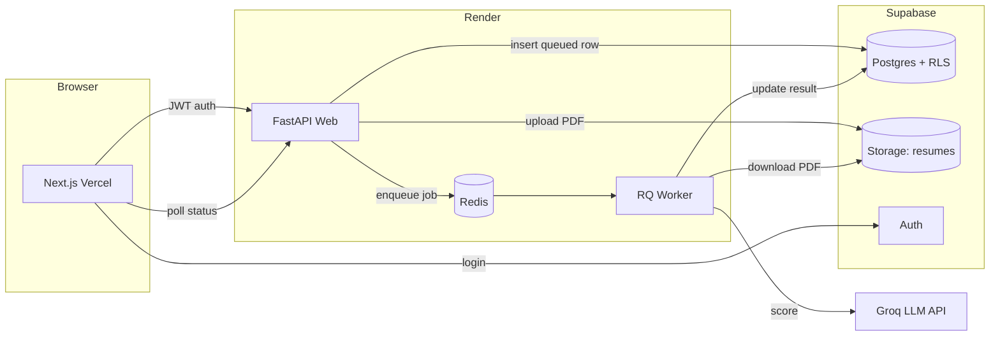

# Resume Matcher

> Score how well a resume matches a job description — with an explanation of
> *why* and a list of *missing skills*. A production-quality, backend-heavy ML
> service built to demonstrate system design, async job processing, auth, and
> LLM integration for SWE / Data-ML new-grad roles.

**Stack:** FastAPI · Redis + RQ · Supabase (Postgres + Auth + Storage) ·
Groq LLM · Next.js · deployed 100% free (Render + Vercel + Supabase).

---

## Architecture



**Request flow**
1. User logs in (Supabase email/password) → gets a JWT.
2. Frontend `POST /api/analyses` (multipart: PDF + JD) with the JWT.
3. API validates, uploads the PDF to Supabase Storage, inserts a `queued` row
   (Row-Level Security scopes it to the user), and enqueues an RQ job carrying
   only metadata.
4. The **worker** downloads the PDF, extracts text, calls Groq for a structured
   match report, and writes the result back to Postgres (via the service_role key).
5. Frontend polls `GET /api/analyses/{id}` until `completed`, then renders the
   score, matched/missing skills, and rationale.

**Free-tier constraints handled**
- *Render sleeps after 15 min idle* → GitHub Actions cron pings `/ping` every 14 min.
- *Supabase pauses after 7 days idle* → cron pings the REST endpoint every run.
- *Groq 30 RPM / ~6K TPM* → single compact JSON request + exponential backoff on 429.
- *Render 512 MB RAM, ephemeral disk* → files live in Supabase Storage, not local disk.
- *Render Redis 25 MB* → only tiny job metadata is queued, never file bytes.

---

## Repository layout

```
resume-matcher/
├─ backend/                 # FastAPI API + RQ worker (deployed on Render)
│  ├─ app/
│  │  ├─ api/               # routes: analyses, auth, health
│  │  ├─ core/              # config, supabase clients, redis queue
│  │  ├─ services/          # pdf_extract, storage, llm, matcher
│  │  ├─ models/            # pydantic schemas
│  │  ├─ db/schema.sql      # Postgres schema + RLS policies
│  │  ├─ worker.py          # RQ task
│  │  └─ main.py            # app factory
│  ├─ tests/                # pytest (unit + integration, externals mocked)
│  ├─ Dockerfile / render.yaml / docker-compose.yml
│  └─ .env.example
├─ frontend/                # Next.js (deployed on Vercel)
│  └─ app/, components/, lib/
└─ .github/workflows/       # backend-ci, frontend-ci, keepalive
```

---

## Local development

### Backend
```bash
cd backend
python -m venv .venv && .\.venv\Scripts\Activate.ps1   # Windows
pip install -r requirements.txt -r requirements-test.txt
cp .env.example .env        # fill SUPABASE_*, GROQ_API_KEY
docker compose up -d redis  # or use a local redis
uvicorn app.main:app --reload --port 10000
pytest tests/ -q
```
Apply `app/db/schema.sql` in the Supabase SQL editor (creates tables + RLS +
the `profiles` trigger). Create a private storage bucket named `resumes`.

### Frontend
```bash
cd frontend
npm install
cp .env.example .env.local  # fill NEXT_PUBLIC_SUPABASE_* + API base URL
npm run dev                 # http://localhost:3000
```

---

## Deployment (all free)

1. **Supabase** — new project; run `backend/app/db/schema.sql`; create a private
   `resumes` bucket; copy Project URL + anon + service_role keys.
2. **Render** — New → Blueprint → connect repo (rootDir `backend`). `render.yaml`
   creates 3 free services: `resume-matcher-api` (web), `resume-matcher-worker`
   (worker), `resume-matcher-redis` (redis). Fill the `sync: false` env vars
   (Supabase URL, anon key, **JWT secret**, service_role key, Groq key, CORS
   origins).
   - The **JWT secret** is the project's "JWT Secret" (Dashboard → API
     settings), used to verify incoming user tokens via HS256. If your project
     uses the newer asymmetric **JWT Signing Keys** (ES256/RS256), leave
     `SUPABASE_JWT_SECRET` blank — the backend will instead fetch the public
     keys from `<SUPABASE_URL>/auth/v1/.well-known/jwks.json`. Either way, the
     `aud`/`role` of user tokens are validated (`authenticated`), not the anon
     key.
3. **Vercel** — import the `frontend` folder, set root dir `frontend`, and add
   `NEXT_PUBLIC_SUPABASE_URL`, `NEXT_PUBLIC_SUPABASE_ANON_KEY`,
   `NEXT_PUBLIC_API_BASE_URL` (your Render web URL).
4. **Keep-alive** — in repo Settings → Secrets add `RENDER_API_URL`,
   `SUPABASE_URL`, `SUPABASE_ANON_KEY`; the `keepalive.yml` cron runs automatically.
5. **CI** — both workflows run on push; tests must pass before deploy confidence.

---

## Key files to read for the system-design story
- `backend/app/api/analyses.py` — REST design, validation, enqueue flow
- `backend/app/worker.py` — async job lifecycle + DB writes (service_role)
- `backend/app/services/llm.py` — prompt design, rate-limit backoff, JSON safety
- `backend/app/db/schema.sql` — schema + Row-Level Security
- `backend/render.yaml` — three-service free-tier topology
- `ARCHITECTURE.md` — deeper tradeoffs and interview talking points
