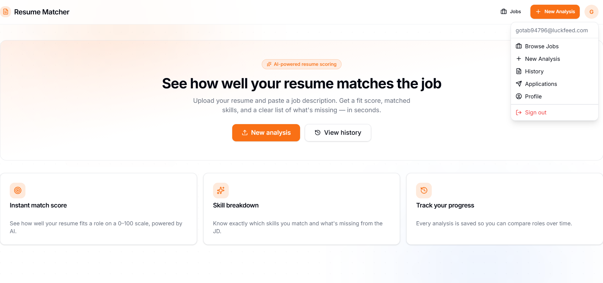
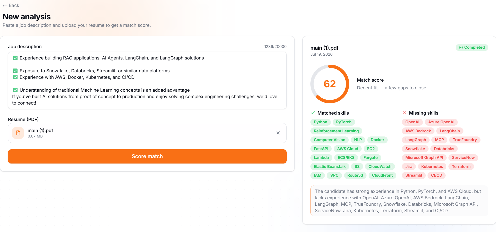
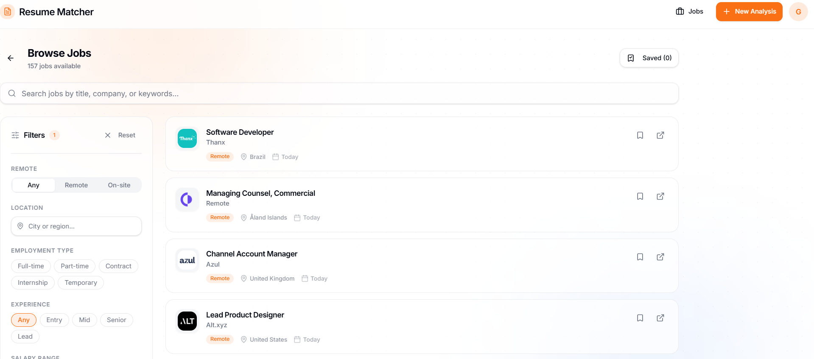

# Resume Matcher

Ever spent hours tweaking your resume for a job posting, only to wonder if it actually hits the right keywords? Resume Matcher takes the guesswork out of it. Paste a job description, upload your resume, and get an instant score with a breakdown of what you've got and what's missing.



## What it does

**Resume scoring** — Upload your PDF resume and a job description. The app sends both to an LLM, which gives you a 0–100 fit score, lists matched skills, flags missing ones, and explains *why* you scored the way you did.



**Job aggregation** — Pulls live listings from RemoteOK, We Work Remotely, Jooble, Adzuna, Arbeitnow, and RSS feeds. Everything gets deduplicated and normalized into one searchable feed with filters for remote, location, employment type, experience level, and salary range.



**Profile & applications** — Build a structured profile (skills, experience, education, projects) either manually or through an AI chat assistant. Track your job applications through a status pipeline from draft to offer.

**Cover letter generation** — Generate tailored cover letters for specific roles based on your profile and the job description.

## Tech stack

- **Backend:** FastAPI, Redis + RQ (async job processing), Supabase (Postgres + Auth + Storage)
- **LLM:** Groq API — used for resume scoring, profile extraction, chat, and cover letters
- **Frontend:** Next.js with shadcn/ui, deployed on Vercel
- **Infrastructure:** Render (free tier) for API + worker + Redis, Supabase for DB/auth, Vercel for frontend

Everything runs on free tiers. No credit card required.

## Getting started

### Backend

```bash
cd backend
python -m venv .venv && source .venv/bin/activate  # Windows: .\.venv\Scripts\Activate.ps1
pip install -r requirements.txt
cp .env.example .env  # fill in your Supabase and Groq keys
docker compose up -d redis
uvicorn app.main:app --reload --port 10000
```

You'll need to run the schema in `backend/app/db/schema.sql` through the Supabase SQL editor and create a private storage bucket called `resumes`.

### Frontend

```bash
cd frontend
npm install
cp .env.local.example .env.local  # fill in Supabase URL + anon key + API base URL
npm run dev
```

Or just run `.\start.ps1` from the root to launch both at once.

## Deployment

The whole thing deploys for free:

1. **Supabase** — Create a project, run the schema, create the `resumes` bucket
2. **Render** — Connect the repo, `render.yaml` sets up the API, worker, and Redis
3. **Vercel** — Import the `frontend` folder, add your env vars

A GitHub Actions cron keeps the Render services alive so they don't sleep.

## Project structure

```
resume-matcher/
├── backend/
│   ├── app/
│   │   ├── api/          # routes
│   │   ├── services/     # LLM, matcher, chat agent, cover letter
│   │   ├── jobs/         # job aggregation system
│   │   └── db/           # schema
│   └── tests/
├── frontend/
│   ├── app/              # Next.js pages (jobs, upload, profile, etc.)
│   ├── components/       # UI components
│   └── lib/              # API client, auth context
└── start.ps1
```
